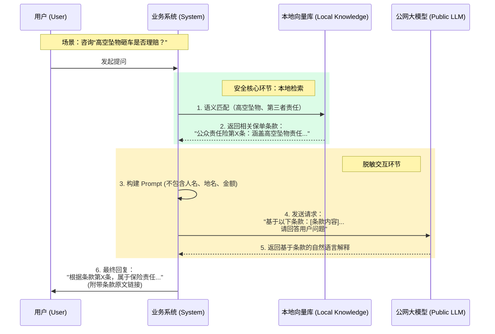

# 系统架构与安全部署规划书

本与系统架构设计旨在响应《xx物业全国统保项目》对**数据安全性**的严苛要求，采用**私有化部署 + 检索增强生成 (RAG)** 的混合架构，确保敏感数据（如保单、理赔细节）不出内网，仅脱敏后的逻辑请求与合规大模型进行交互。

## 1. 系统总体逻辑架构图 (Network Topology)

系统划分为三个严格隔离的安全域：**互联网接入区 (H5)**、**业务核心区 (Intranet)** 和 **数据核心区 (Database)**。

```mermaid
graph TD
    subgraph Public_Internet [互联网接入区]
        User((物业管家/用户))
        WeChat[微信/企业微信]
        H5_App[H5 前端小程序]
    end

    subgraph DMZ_Zone [DMZ 隔离区 / 防火墙前置]
        WAF[WAF Web应用防火墙]
        LB[Nginx 负载均衡]
    end

    subgraph Private_Cloud [企业私有云 / 业务核心区]
        API_Gateway[API 网关 (鉴权/限流)]
        
        subgraph Services [微服务集群]
            Auth_Svc[认证服务 (MFA)]
            Flow_Svc[理赔流程引擎]
            Audit_Svc[安全审计探针]
            AI_Agent[AI 智能助理服务]
        end
        
        subgraph AI_Core [AI 核心引擎 (RAG)]
            Vector_Eng[向量检索引擎]
            Prompt_Eng[提示词工程/脱敏]
        end
    end

    subgraph Data_Zone [数据核心区 (三级等保)]
        DB_Master[(MySQL 业务库)]
        DB_Vector[(Milvus 向量知识库)]
        Obj_Store[MinIO 文件存储]
    end

    subgraph External_Model [合规模型接入]
        LLM_API[国产大模型 API (百度/阿里)]
    end

    %% Data Flow Connections
    User --> WeChat
    WeChat --> H5_App
    H5_App -- HTTPS/TLS 1.3 --> WAF
    WAF --> LB
    LB --> API_Gateway
    
    API_Gateway --> Auth_Svc
    API_Gateway --> Flow_Svc
    API_Gateway --> AI_Agent
    
    Flow_Svc --> DB_Master
    Flow_Svc --> Obj_Store
    
    %% AI RAG Flow
    AI_Agent --> Prompt_Eng
    Prompt_Eng -- 1. 语义检索 --> Vector_Eng
    Vector_Eng -- 2. 返回本地知识片段 --> Prompt_Eng
    Prompt_Eng -- 3. 发送脱敏Prompt --> LLM_API
    LLM_API -- 4. 返回逻辑推理结果 --> Prompt_Eng
    
    %% Audit
    API_Gateway -.-> Audit_Svc
    Audit_Svc -.-> DB_Master
    
    %% Styling
    style Public_Internet fill:#f9f9f9,stroke:#333,stroke-dasharray: 5 5
    style Private_Cloud fill:#e0f2fe,stroke:#0284c7
    style Data_Zone fill:#dcfce7,stroke:#16a34a
    style External_Model fill:#fae8ff,stroke:#86198f
```

---

## 2. 敏感数据隐私保护流程 (Privacy-Preserving AI Flow)

针对监管重点关注的“算法模型训练数据泄露”风险，本系统**不使用客户数据微调大模型**，而是采用 RAG 技术。大模型仅作为“逻辑处理器”，所有业务知识保留在本地数据库。



---

## 3. 安全合规部署清单

为了满足**等保三级 (Level 3)** 要求，建议在私有云环境配置以下安全组件：

| 组件名称 | 推荐选型 | 作用描述 | 对应合规点 |
| :--- | :--- | :--- | :--- |
| **WAF 防火墙** | 阿里云 WAF / 雷池(SafeLine) | 拦截 SQL 注入、XSS、爬虫 | 网络安全 - 边界防护 |
| **堡垒机** | JumpServer (开源版) | 运维操作审计、权限回收 | 主机安全 - 运维审计 |
| **数据库审计** | Yearning / 自研探针 | 记录所有 SQL 查询与导出操作 | 数据安全 - 操作痕迹 |
| **向量数据库** | Milvus / PostgreSQL(pgvector) | 存储私有知识库，支持本地化部署 | 数据安全 - 数据本地化 |
| **API 网关** | Kong / APISIX | 流量控制、黑白名单、身份认证 | 应用安全 - 访问控制 |

## 4. 灾备与高可用策略

*   **数据备份**：采用“两地三中心”或简单的“本地+异地灾备”策略。数据库开启 Binlog 实时增量备份，每天凌晨 2:00 进行全量冷备。
*   **服务熔断**：当公网 LLM 接口响应超时（>30s）或不可用时，AI Agent 自动降级为“关键词匹配模式”，仅返回标准 FAQ 答案，确保业务不中断。

